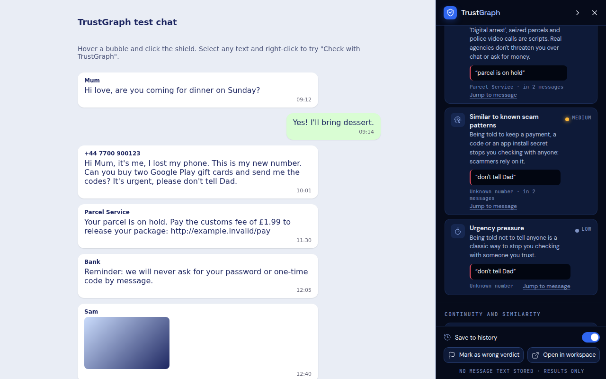
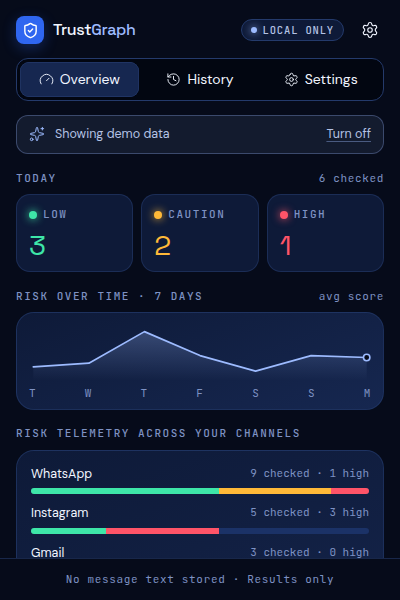
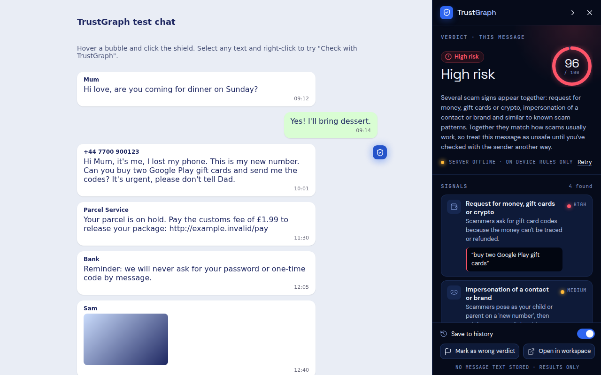
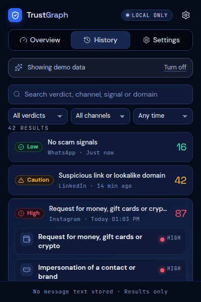

<p align="center">
  
</p>

<h1 align="center">TrustGraph</h1>

## Connected React workspace (current FastAPI backend)

The frontend is in **`front end/`**. See [setup instructions](front%20end/README.md) and [integration details](docs/WORKSPACE_INTEGRATION.md). Configure PostgreSQL in the ignored root `.env`, build the frontend, then run `python run_server.py` to serve both at http://127.0.0.1:8000.

The current backend has no authentication or trained AI detector. Message analysis returns pending/null scores and is not automatically saved. History reads existing database records; account/pairing/review/delete controls are unavailable. Keep this prototype private/local. Older extension/engine sections below describe separate or legacy components, not features of this connected backend.

<p align="center">
  <strong>A privacy-first browser extension that checks any message for scam signals, right where you read it. Only the verdict comes home.</strong>
</p>

<p align="center">
  
  
  
</p>

---

## 👥 Team

**Team Name:** `[TEAM NAME]`

| Member     | Role      | Institution |
| ---------- | --------- | ----------- |
| **[Name]** | Team Lead | [College]   |
| **[Name]** | [Role]    | [College]   |
| **[Name]** | [Role]    | [College]   |
| **[Name]** | [Role]    | [College]   |

---

## 🎯 Problem Statement

The rapid advancement of generative AI has made it increasingly difficult to distinguish authentic content from artificially generated or manipulated content.

Deepfakes, cloned voices, synthetic images, fabricated documents, and other AI-assisted techniques can enable **impersonation, misinformation, identity theft, financial fraud, and social engineering attacks**.

**Scammers now write fluent, personalised messages at scale: fake bank KYC alerts, "Hi Mum, this is my new number", OTP and UPI-PIN requests, task-job and investment offers, "digital arrest" threats. They arrive in the chat and email apps people already use, in English and in regional languages, and people have no quick, private way to check a message before they reply, pay or share a code.**

---

## 💡 Solution

### TrustGraph

**TrustGraph** is a **Chrome extension (Manifest V3)** that detects and explains **AI-assisted and social-engineering scam messages**.

The user hovers a message on Gmail, WhatsApp Web, LinkedIn, Telegram, Discord, Slack, Messenger or Instagram (or selects text anywhere) and clicks a shield. A **scoring engine** analyses the text in memory and returns a **risk verdict (Low / Caution / High), a 0–100 score, a plain-language explanation and the signals behind it**. Only that verdict and its metadata are ever stored or synced. The message text never is.

### Key Features

* 🔴 **One-click checks where you read** — a shield on each message, a whole-chat scan in a side panel that pushes the page aside instead of covering it, and right-click "Check with TrustGraph" on any site.
* ⚪ **Explainable verdicts** — a score ring, a one-paragraph explanation, and eight signal types (urgency, money/gift-card/crypto requests, OTP/credential requests, lookalike links, sender mismatch, impersonation, continuity break, known-pattern similarity), each with the exact words that matched.
* ⚫ **Multilingual rules** — English, Malayalam, Manglish, Hinglish and Hindi, with leetspeak and spacing tricks normalised and negation understood ("we will never ask for your OTP").
* 🔴 **Conversation awareness** — scores runs of messages from one sender together and flags a sender whose ordinary messages suddenly turn into requests (a hacked or impersonated account).
* ⚪ **Privacy by construction** — the stored record has no text field (a unit test fails if one is added); history export / delete anytime; no scam-report database in the extension; works offline.
* ⚫ **Python detection engine and API (optional server)** — a four-signal scoring engine (anomaly, identity continuity, scam-wording similarity, report precedent) with a demo page, and a FastAPI backend that matches messages against reported scams and checks MP4 videos for deepfakes (EfficientNet-B0 backbone + a trainable real/fake layer).

---

## 🔄 How It Works

```text
  Web page (Gmail, WhatsApp, ...)          Extension service worker               Web app (optional)
 ┌───────────────────────────────┐   typed   ┌──────────────────────────────┐    ┌──────────────────────┐
 │ 1. EXTENSION DETECTS          │ messages  │ 2. ENGINE THINKS             │    │ 3. SHOWS & MANAGES   │
 │ site adapter finds messages   │──────────▶│ LocalEngine: on-device rules │    │ history, export,     │
 │ shield / chat scan / select   │  (text,   │ RemoteEngine: scoring server │    │ workspace view       │
 │ side panel (closed shadow DOM)│  memory   │   + local rules, higher wins │    │                      │
 │ text kept in memory only      │◀──────────│ -> Verdict {riskLevel, score,│    │                      │
 └───────────────────────────────┘  Verdict  │    explanation, signals}     │    │                      │
                                             │ -> Result (NO TEXT) ─────────┼───▶│ POST /api/results    │
                                             │    chrome.storage history    │    │ (verdict + metadata) │
                                             └──────────────────────────────┘    └──────────────────────┘
```

Optional Python server (this repository's `app/` and `src/trustgraph/`):

```text
  text  -> normalize -> embed (MiniLM) -> match explicitly reported scams -> LOW / MEDIUM / HIGH + evidence ids
  video -> validate MP4 -> ~1 frame/s -> largest face -> EfficientNet-B0 (frozen) + real/fake layer
        -> per-face scores -> likely_fake / likely_real / inconclusive
  detector engine: anomaly + continuity + similarity + precedent --noisy-OR--> Low / Caution / High + explanation
```



*Whole-chat scan: verdict, signals with evidence, continuity and similarity.*

---

## 🛠️ Technology Stack

### Software

| Layer          | Technologies                             |
| -------------- | ---------------------------------------- |
| **Frontend**   | Chrome extension, Manifest V3, plain JavaScript (no build step), Shadow DOM, Lucide icons, bundled Space Grotesk / DM Sans / JetBrains Mono |
| **Backend**    | Optional TrustGraph scoring server (`POST /api/score`); Python standard-library mock in `trustgraph_extension/scripts/mock_server.py`; FastAPI backend in `app/` (`/api/text/*`, `/api/video/analyze`) |
| **AI / ML**    | Explainable weighted rule engine (`score = 1 − ∏(1 − w)` plus combination rules); pluggable `RemoteEngine` for a model server; Python engine: scikit-learn (Isolation Forest, TF-IDF), sentence-transformers all-MiniLM-L6-v2, PyTorch + Hugging Face `google/efficientnet-b0`, OpenCV face detection |
| **Database**   | `chrome.storage.local` (verdict history only); web-app sync through an `ApiClient` with a built-in mock |
| **Processing** | Unicode/leetspeak normalisation, URL heuristics (lookalike brands, punycode, shorteners, raw IPs, risky TLDs) |
| **Deployment** | Chrome Web Store package via `scripts/build_zip.py` |

### Tools

* Git & GitHub
* Node.js (unit tests), Playwright + Chromium (in-browser tests and screenshots)
* Python 3 (mock scoring server, icon and zip builders)

---

## 📸 Project Preview

### Main Interface



*Toolbar popup: today's verdicts, 7-day risk trend and risk per channel.*

### Detection / Analysis



*Checking one message: the side panel shows the verdict, score and signals with the words that matched.*

### Results



*History keeps verdicts and metadata only, never the message.*

---

## 📊 Results

| Metric                 | Result                                      |
| ---------------------- | ------------------------------------------- |
| **Detection Accuracy** | 100% on the 52-message test set (27 scams, 25 benign) |
| **Precision**          | 100% (same set)                                       |
| **Recall**             | 100% (same set)                                       |
| **Response Time**      | ~0.08 ms per message for the on-device engine (Node, measured); remote engine bounded by a 3 s timeout with local fallback |
| **Supported Input**    | Text messages and emails (English, Malayalam, Manglish, Hinglish, Hindi), including links |

> **Note:** The test set (`trustgraph_extension/test/rules.test.js`) was written by the team, including tricky benign cases (bank alerts, developer chats about OTP flows). It is not a real-world benchmark; expect lower numbers on live traffic.

**Python detection engine** (`src/trustgraph`, the 4-signal server). **All numbers come from synthetic (AI-written) messages**,
except the real-SMS row; they are not real-world accuracy:

| Metric | Result |
| ------ | ------ |
| Scams caught, frozen synthetic test (2,294 messages, 29 scam types, text only) | 74.0%, with 8.6% of honest messages flagged |
| Scams caught, final test of the 10-round improvement routine (used once) | 65.0% (starting engine 51.7%), 0.0% of honest messages flagged |
| Real UK text messages wrongly flagged (4,827 honest SMS, public dataset) | 3.6–9.6% depending on the version |
| Named demo scenarios | 18/18 scams flagged, 6/6 honest controls kept Low |
| Deepfake video | Pipeline built and tested; no trained real/fake model yet, so no accuracy to report |

Reports: `reports/2026-10-05-casual/CHANGES.md`, `reports/fast/final_summary.md`, `reports/2026-10-05-training/training_summary.md`.

---

## 🚀 Getting Started

### Prerequisites

* Google Chrome (or any Chromium browser, version 110+)
* Optional: Python 3 for the mock scoring server, Node.js 18+ to run the tests

### Installation

```bash
git clone https://github.com/ritvikpradeep-23/trustgraphai
cd trustgraphai/trustgraph_extension
```

1. Open `chrome://extensions` and turn on **Developer mode**.
2. Click **Load unpacked** and choose the `trustgraph_extension/` folder.

### Environment Variables

None. The scoring server and web app addresses are set in the extension's Settings page (defaults: `http://127.0.0.1:8000` and a built-in demo web app).

### Run

```bash
# optional: a stand-in scoring server
python3 scripts/mock_server.py --new-shape

# tests
node test/rules.test.js && node test/verdict.test.js && node test/result.test.js && node test/background.test.js && node test/tokens.test.js
```

**Python engine and API (optional):**

```bash
pip install -r requirements.txt               # from the repository root
python run_server.py                          # ONE local service at http://127.0.0.1:8000 (or double-click start_server.bat)
python scripts/seed_reports.py                # 10 example scam reports for the API
python -m pytest                              # Python tests (or double-click run_tests.bat)
```

`run_server.py` serves everything the extension and website need: the test page (`/`), the scam check
(`POST /api/score`, which the extension already calls), the AI-written text check (`POST /api/text/ai-check`; also
added to `/api/score` replies as `ai_written` once the text model is trained), deepfake video
(`POST /api/video/analyze`), similar-report search (`/api/text/report`, `/api/text/analyze`) and the accuracy
routine's latest results (`GET /api/accuracy`). All endpoints are listed at `/docs`. The older
`python run_website.py` (scam check + page only) still works; don't run both, they use the same port.

**What it can and can't do, and how to tune it:** [`docs/CAPABILITIES_AND_LIMITS.md`](docs/CAPABILITIES_AND_LIMITS.md).

**Learning new scams:** `learn_cycle.py` takes one fresh dataset it has never used (yours from
`data/learning/datasets/`, else a new synthetic one) plus reported scams (`POST /api/feedback`, `add_examples.py`),
records how many it caught *before* learning them, learns the misses, then waits 2 hours before the next dataset. Every new version must pass the safety
gate and goes live only when you promote it. See [`docs/NEW_SCAM_LEARNING.md`](docs/NEW_SCAM_LEARNING.md).

Settings for the API (thresholds, video limits, `DEEPFAKE_MODE` = mine / efficientnet / both, CORS origins) are listed in
`.env.example`. The deepfake endpoint answers `503 model_not_configured` until a trained model is installed
(`models/README.md`); it never makes up a score.

**Deepfake video + AI-text detectors with a scheduled accuracy routine:** `train_video.py`, `train_text.py`,
`run_cycle.py` (scores one fresh, never-reused test batch every `INTERVAL_HOURS`) and `show_report.py`. Setup,
datasets and what the numbers mean: [`docs/DETECTION_ROUTINE.md`](docs/DETECTION_ROUTINE.md).

The welcome page opens on install. To try it without real chats, open the toolbar popup → **Use without account** → Settings → **Demo data**, or serve the test chat:

```text
cd trustgraph_extension && python3 -m http.server 5500
http://localhost:5500/test/test-chat.html
```

---

## 🎥 Demo

### Live Demo

**[LIVE DEMO URL]**

### Demo Video

**[DEMO VIDEO URL]**

> The demo demonstrates the complete workflow from input submission to fraud detection, analysis, and final result.

---

## 🧪 Example

**Input**

```text
Dear customer your SBI KYC is pending and your account will be blocked today.
Share the OTP sent to you at http://sbi-kyc-update.xyz urgently
```

**System Analysis**

```text
Credential or OTP request            HIGH   "Share the OTP"
Suspicious link or lookalike domain  HIGH   "http://sbi-kyc-update.xyz"  (bank name on an unofficial .xyz domain,
                                                                          plus official warning + suspicious link)
Impersonation of a contact or brand  HIGH   "KYC is pending"
Urgency pressure                     LOW    "urgently"
```

**Result**

```text
FRAUDULENT (likely scam)
Score: 95 / 100
Risk Level: HIGH
```

---

## 🔐 Security & Privacy

The system is designed with user privacy and responsible AI usage in mind.

* **No message text is stored, synced or logged.** It lives in memory for the length of a check. The only stored record (`shared/result.js`) is `id, timestamp, riskLevel, score, signalIds, channel, domain, hash?`, and `test/result.test.js` fails if a field is added or any word of a message reaches storage.
* **Nothing is read until the user clicks** (auto-scan is opt-in); the user's own messages are never checked.
* **No scam-report or public submission database in the extension.** "Mark as wrong verdict" sends only a verdict id. (The optional Python API keeps only messages a user explicitly *reports*, never ones that are just checked, and never returns one user's report text to another.)
* **Uploaded videos (Python API)** are written to a temporary file and deleted right after analysis, even when it fails.
* **No passwords in the extension.** Sign-in happens on the web app, which hands the extension a one-time pairing code.
* **Isolation:** all in-page UI is in closed shadow roots and built with `textContent` (never `innerHTML`), so message text can't inject markup. No remote code, analytics or ads. Fonts are bundled.
* **Minimum permissions:** `activeTab`, `storage`, `contextMenus`, `scripting`; all-sites and notifications access are optional and requested only when the user turns them on.

---

## 🔮 Future Scope

* [ ] Improve detection accuracy with larger and more diverse datasets
* [ ] Support additional types of AI-generated content
* [ ] Add real-time detection capabilities
* [ ] Improve explainability of detection results
* [ ] Deploy scalable inference infrastructure
* [ ] Calibrate the LinkedIn, Telegram, Discord, Slack, Gmail, Messenger and Instagram adapters against live pages
* [ ] Connect the production web app and model server (`/api/results`, `/api/score`)
* [ ] Learn from "Mark as wrong verdict" feedback
* [ ] Voice-note and image (screenshot) scam detection

---

## 👨‍💻 Team Contributions

* **[Member 1]** — [Architecture / AI model / Backend / etc.]
* **[Member 2]** — [Frontend / UI / Integration / etc.]
* **[Member 3]** — [Dataset / ML / Testing / etc.]
* **[Member 4]** — [Research / Documentation / Deployment / etc.]

---

## 🏆 Hackathena '26 2.0

This project was developed as part of **Hackathena '26 2.0**, organized by the **Department of Computer Science & Engineering and CESA, Jyothi Engineering College**.

### Theme

> **Detection and Prevention of AI-Based Frauds**

The project focuses on addressing emerging forms of fraud enabled or amplified by generative artificial intelligence, including **deepfakes, cloned voices, synthetic media, fabricated documents, and AI-assisted impersonation**.

---

## 📄 Repository Structure

```text
.
├── trustgraph_extension/   # The Chrome extension (Manifest V3, no build step)
│   ├── background.js       # Service worker: engines, history, account, network
│   ├── content/            # Shield, side panel, chat scan
│   ├── adapters/           # Per-site message readers (+ config-driven sites)
│   ├── shared/             # Design system, Verdict + Result, rules engine, ApiClient
│   ├── ui/                 # Popup, welcome + settings, privacy, demo web app
│   ├── test/               # Unit + in-browser tests and fixtures
│   ├── dev/                # Component gallery
│   ├── store/              # Chrome Web Store listing and policies
│   └── scripts/            # Mock server, icon and zip builders
├── app/                    # Python API (FastAPI): text matching, deepfake video, adapter interface
├── src/trustgraph/         # Python 4-signal detection engine + demo page (web/)
├── models/                 # Engine model files, candidate bundles, deepfake model slot (see models/README.md)
├── data/  eval/            # Synthetic sample data and the evaluation set
├── training/  routine/     # Training experiments and the 10-round improvement routine
├── reports/                # Results (marked synthetic where they are)
├── scripts/                # Seeding, promote/rollback, rounds, EfficientNet training and demo scripts
├── tests/                  # Python tests (pytest)
├── docs/
│   ├── screenshots/        # Screenshots of every surface
│   ├── redesign-handoff.md # Notes on the UI redesign
│   └── TRUSTGRAPH_DETAILS.md # Python engine and API details
├── requirements.txt  .env.example
└── README.md
```

Full developer documentation: [`trustgraph_extension/README.md`](trustgraph_extension/README.md).

---

## 📬 Contact

For questions, collaboration, or further information:

**Team:** [TEAM NAME]
**Team Lead:** [NAME]
**Email:** [EMAIL]
**GitHub:** https://github.com/ritvikpradeep-23/trustgraphai

---

<p align="center">

<strong>Hackathena '26 2.0</strong>

<br>

Detection & Prevention of AI-Based Frauds

<br><br>


</p>
